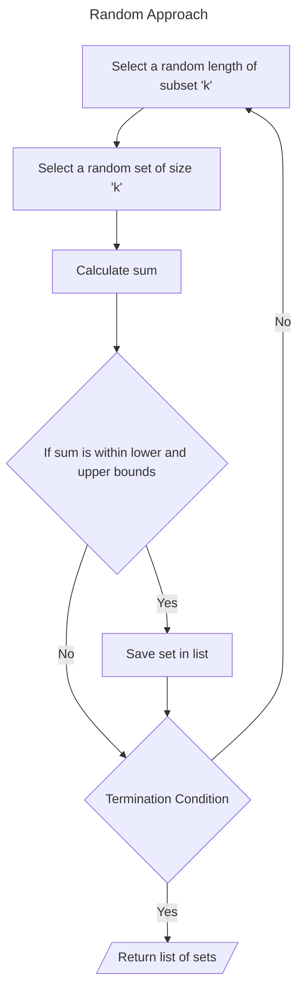

# 📝 Mini Project 04 - ComboFinder
> **Course**: [Thapar's Machine Learning Summer School, 2025](https://www.thaparsummerschool.com/)
> 
> **Student Name**: Ikansh Mahajan
>
> **Student Roll No.**: 102303754

## 🔎 Problem Statement
Find the list of products whose sum of prices is between a lower and upper bound.

## 🔬 Solution

## 🚀 How to Run Notebook
Click on the    button on top of the notebook to open it in Google Colab and experiment with my solution by copying it to your Drive.

## 🧾 Reflections
This assignment gave me a hands-on exposure to:
- Randomisation in Python
- Clean notebook structuring
- Writing Pythonic and optimized code
- Mathematical reasoning and edge case handling
- GitHub handling

## ⚠️ Report Issues
Create an issue ticket using the `Issues` section up above.
